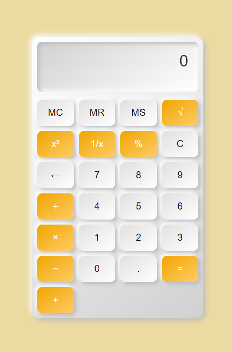

# **Calculator 🚀**

This is an calculator web application with a sleek, three-dimensional design. The calculator performs basic arithmetic operations like addition, subtraction, multiplication, and division, along with advanced functionalities such as square root, square, reciprocal, and percentage. It provides a modern user interface designed using HTML, CSS, and JavaScript, with a responsive layout and engaging user interactions.

---

## **Features 🌟**

- **Basic Arithmetic Operations**: Addition, subtraction, multiplication, and division.
- **Advanced Functions**: 
  - Square root
  - Square
  - Reciprocal
  - Percentage calculation
- **3D Visual Effects**: 
  - Buttons and display with a three-dimensional look using shadows and gradients.
  - Interactive "press" effect on button clicks.
- **Memory Functions**: 
  - Memory Clear (`MC`), Memory Recall (`MR`), and Memory Store (`MS`).
- **Responsive Design**: The calculator adapts to various screen sizes.

---

## **Tech Stack 🛠️**

- **HTML5**: For the structure of the calculator.
- **CSS3**: For styling, including gradients, shadows, and animations to create a 3D effect.
- **JavaScript**: For handling calculations and interactive functionality.

---

## Installation and Usage 🚀

1. Clone the repository:
   ```bash
   git clone https://github.com/CornHaki/CodSoft_Task_3.git
2. Navigate to the project directory:
   ```bash
   cd CodSoft_Task_3
3. Open the ```index.html``` file in your browser.
   ```bash
   open index.html

 ---

## Live Demo 🚀
[Visit Here](https://cornhaki.github.io/CodSoft_Task_3/)

 ---

## Screenshots 📸


---

## **📂 Folder Structure**

```plaintext
project-directory/
└── .vscode/
│     └── settings.json
├── assets/
│     └── image1.png
├── README.md           # Project description and details
├── index.html          # Main HTML file
├── script.js           # JavaScript file for calculator logic
└── styles.css          # CSS file for styling
```
---
## Author 🖋️
Dimpal Baishya
---

## *📬 Contact Me*
Feel free to connect with me:

📧 Email: baishyadimpal31@gmail.com
---
